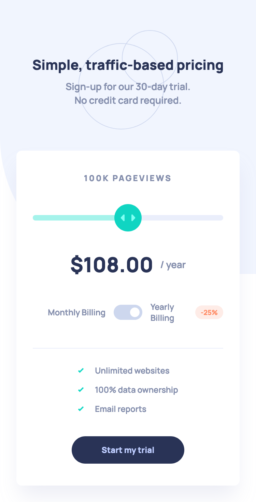

# Frontend Mentor - Interactive pricing component solution

This is a solution to
the [Interactive pricing component challenge on Frontend Mentor](https://www.frontendmentor.io/challenges/interactive-pricing-component-t0m8PIyY8).
Frontend Mentor challenges help you improve your coding skills by building realistic projects.

## Overview

### The challenge

Users should be able to:

- [x] View the optimal layout for the app depending on their device's screen size
- [x] See hover states for all interactive elements on the page
- [x] Use the slider and toggle to see prices for different page view numbers

### Screenshot

| Mobile                            | Tablet                            | Desktop                            |
|-----------------------------------|-----------------------------------|------------------------------------|
|  |  |  |

### Links

- [Solution URL](https://www.frontendmentor.io/solutions/interactive-pricing-with-nextjs-and-tailwind-f0GgsQdyAe)
- [Live Site URL](https://edrick-interactive-pricing.netlify.app/)
