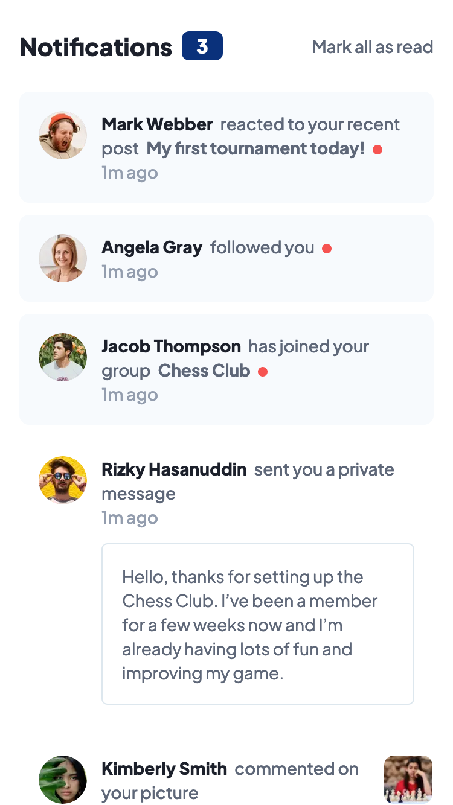
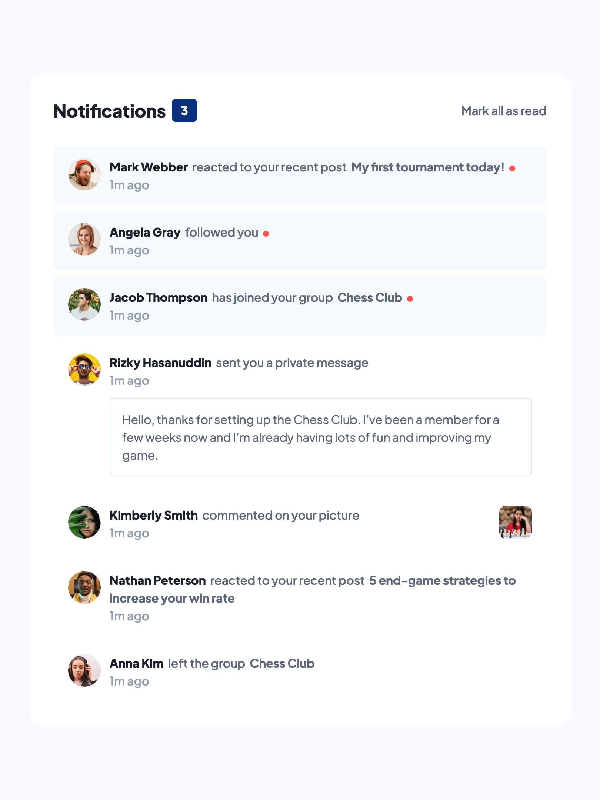
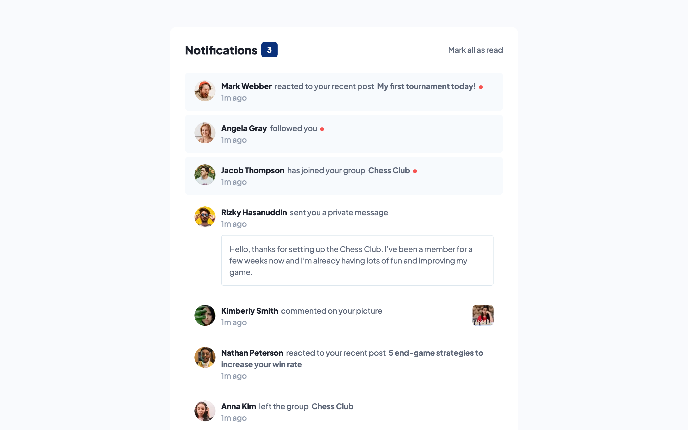

# Frontend Mentor - Notifications page solution

This is a solution to the [Notifications page challenge on Frontend Mentor](https://www.frontendmentor.io/challenges/notifications-page-DqK5QAmKbC). Frontend Mentor challenges help you improve your coding skills by building realistic projects. 

## Overview

### The challenge

Users should be able to:

- [x] Distinguish between "unread" and "read" notifications
- [ ] Select "Mark all as read" to toggle the visual state of the unread notifications and set the number of unread messages to zero
- [x] View the optimal layout for the interface depending on their device's screen size
- [x] See hover and focus states for all interactive elements on the page

### Screenshot

| Mobile                            | Tablet                            | Desktop                            |
|-----------------------------------|-----------------------------------|------------------------------------|
|  |  |  |

### Links

- [Solution URL](https://www.frontendmentor.io/solutions/notifications-page-with-nextjs-and-tailwind-V5WPk8J9Hy)
- [Live Site URL](https://edrick-notifications-page.netlify.app/)
