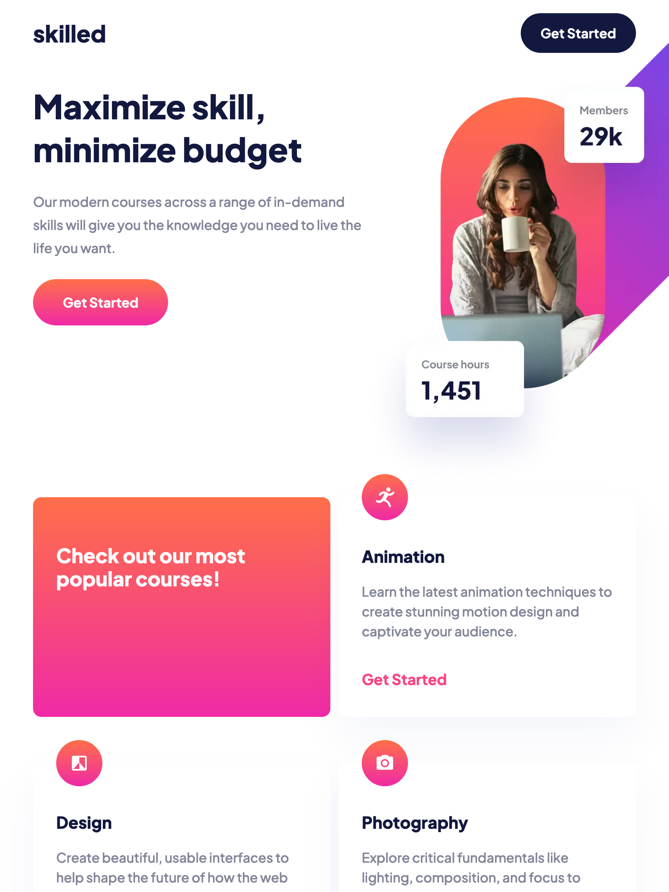
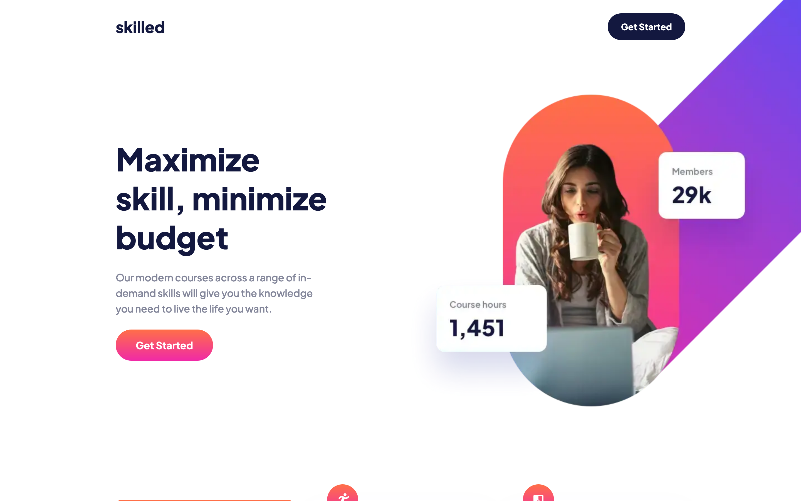

# Frontend Mentor - Skilled e-learning landing page solution

This is a solution to
the [Skilled e-learning landing page challenge on Frontend Mentor](https://www.frontendmentor.io/challenges/skilled-elearning-landing-page-S1ObDrZ8q).
Frontend Mentor challenges help you improve your coding skills by building realistic projects.

## Overview

### The challenge

Users should be able to:

- [x] View the optimal layout depending on their device's screen size
- [x] See hover states for interactive elements

### Screenshot

| Mobile                            | Tablet                            | Desktop                            |
|-----------------------------------|-----------------------------------|------------------------------------|
|  |  |  |

### Links

- [Solution URL](https://www.frontendmentor.io/solutions/skilled-elearning-with-nextjs-and-tailwind-_-bX1zU2lk)
- [Live Site URL](https://edrick-skilled-elearning.netlify.app/)
