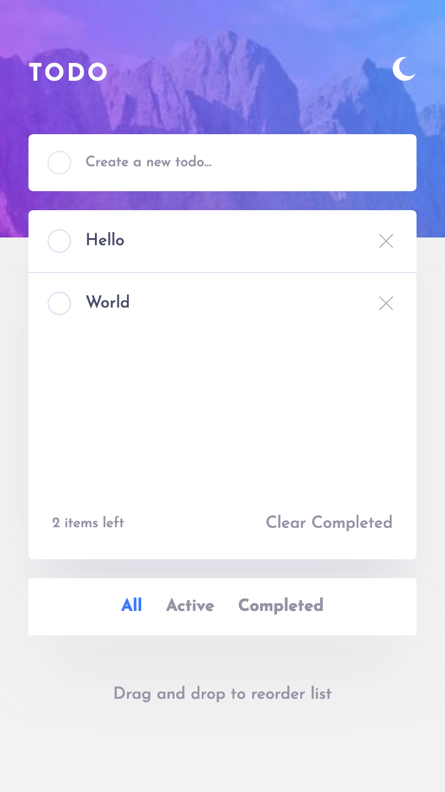
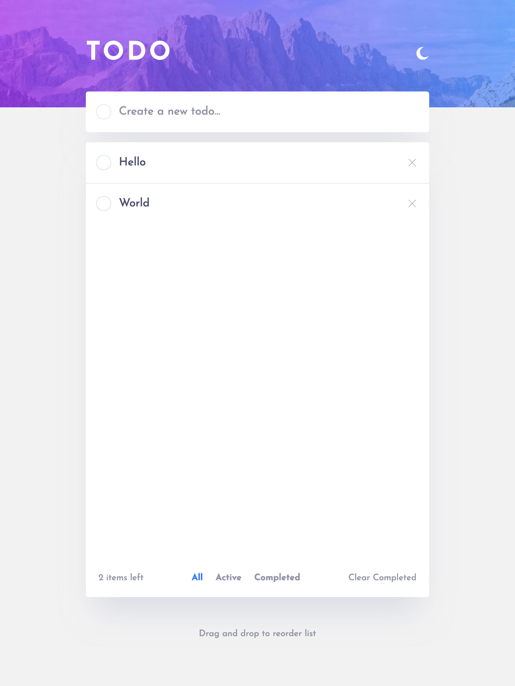
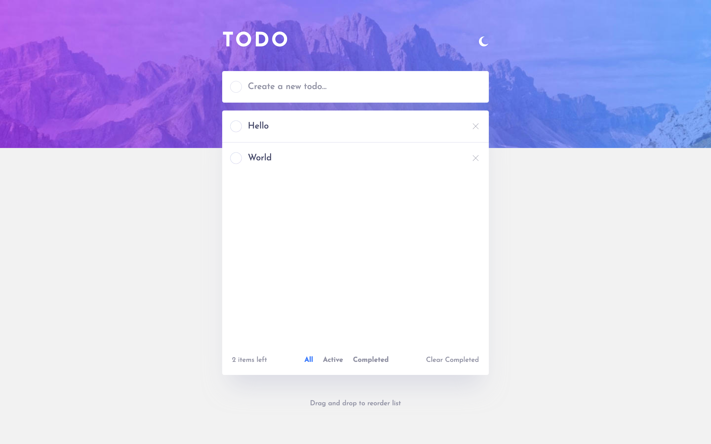

# Frontend Mentor - Todo app solution

This is a solution to
the [Todo app challenge on Frontend Mentor](https://www.frontendmentor.io/challenges/todo-app-Su1_KokOW). Frontend
Mentor challenges help you improve your coding skills by building realistic projects.

## Overview

### The challenge

Users should be able to:

- [x] View the optimal layout for the app depending on their device's screen size
- [x] See hover states for all interactive elements on the page
- [x] Add new todos to the list
- [x] Mark todos as complete
- [x] Delete todos from the list
- [x] Filter by all/active/complete todos
- [x] Clear all completed todos
- [x] Toggle light and dark mode
- [ ] **Bonus**: Drag and drop to reorder items on the list

### Screenshot

| Mobile                            | Tablet                            | Desktop                            |
|-----------------------------------|-----------------------------------|------------------------------------|
|  |  |  |

### Links

- [Solution URL](https://www.frontendmentor.io/solutions/todo-app-with-nextjs-and-tailwind-zizk8Yr_vc)
- [Live Site URL](https://edrick-todo-app.netlify.app/)

### Future Improvements

- [ ] Save tasks on the server
- [ ] Add user authentication
- [ ] Add animations
- [ ] Mobile app
- [ ] Desktop app
